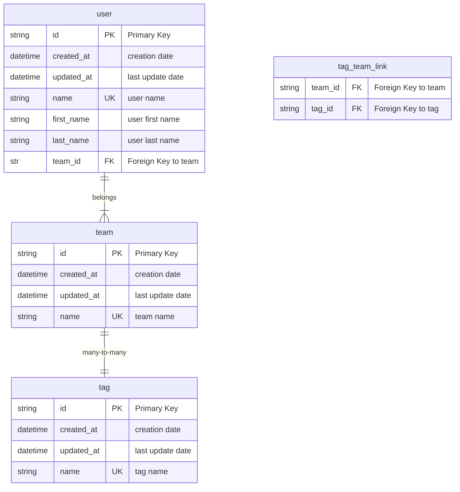

# fastapi-demo

Based on the tutorials for [FastAPI](https://fastapi.tiangolo.com/tutorial/) and [SQLModel](https://sqlmodel.tiangolo.com/),
this project serves a simple demonstration of creating a REST API using FastAPI and SQLModel, incorporating async DB operations, and adhering to what I understand as best practices.

## Database

The database uses PostgreSQL for regular operations and SQLite for testing with the following schema.
Of course, with ORM, we can easily change the database type.

### Schema

### Alembic

`alembic init -t async migrations`
