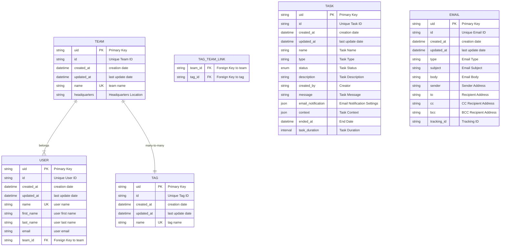

# fastapi-demo

[](https://codecov.io/gh/copdips/fastapi-demo)

Based on the tutorials for [FastAPI](https://fastapi.tiangolo.com/tutorial/) and [SQLModel](https://sqlmodel.tiangolo.com/),
this project serves a simple demonstration of creating a REST API using FastAPI and SQLModel, incorporating async DB operations, and adhering to what I understand as best practices.

## Database

The database uses PostgreSQL for regular operations and SQLite for testing with the following schema.
Of course, with ORM, we can easily change the database type.

### Schema



### Alembic

```bash
alembic init -t async migrations
# edit alembic.ini and env.py

alembic revision --autogenerate -m "init"

# offline migration to generate SQL file with run_migrations_offline()
py_file=$(ls -t migrations/versions/*.py | head -n1)
sql_file="${py_file%.*}.sql"
alembic upgrade head --sql > $sql_file

# online migration
alembic upgrade head

# online migration to a specific revision
alembic upgrade <revision>
```

### Recreate schema public

```sql
DROP SCHEMA public CASCADE;
CREATE SCHEMA public;
```

## External Task

Celery might not be the best tool: <https://github.com/tiangolo/full-stack-fastapi-template/pull/694>

## Profiling

### Pyinstrument

<https://pyinstrument.readthedocs.io/>

Add `$profile=1` in query param

### Py-spy

<https://github.com/benfred/py-spy>

```bash
py-spy top -- python -m uvicorn app.main:app

# or
make run
lsof -i :8000
py-spy top --pid $python_pid

# or dump current call stack to console
py-spy dump --pid $python_pid
py-spy dump --pid $python_pid --locals # with locals vars
```

Run in Docker:

```yaml
# https://github.com/benfred/py-spy?tab=readme-ov-file#how-do-i-run-py-spy-in-docker
your_service:
   cap_add:
     - SYS_PTRACE
```

Run in Kubernetes:

```yaml
# https://github.com/benfred/py-spy?tab=readme-ov-file#how-do-i-run-py-spy-in-kubernetes
securityContext:
  capabilities:
    add:
    - SYS_PTRACE
```
